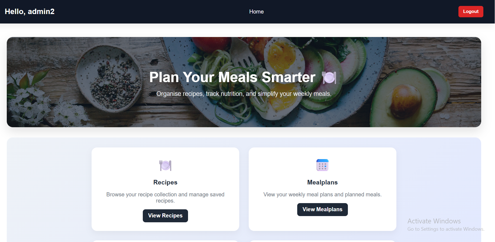
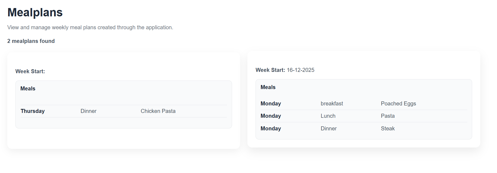

# 🍽️ Meal Planning & Recipe Management Web Application

A full-stack web application developed using Angular, Flask, and MongoDB to help users manage recipes, create meal plans, and track nutrition efficiently.

---

## 🚀 Features

- ✅ Recipe CRUD (Create, Read, Update, Delete)
- ✅ Meal Planning System
- ✅ Nutrition Tracker (BMR Calculation)
- ✅ High-Protein Recipe Suggestions
- ✅ Role-Based Access Control (Admin & User)
- ✅ Responsive Dashboard UI
- ✅ Dynamic Pie Chart using CSS Conic Gradients

---

## 🖼️ Application Screenshots

### 🏠 Homepage

### 🍲 Recipes

### 📅 Meal Plans

### 📊 Nutrition Tracker

### 🔐 Admin Panel

---

## 🏗️ System Architecture

The application follows a full-stack architecture:

- **Frontend (Angular)** → Handles UI, routing, and user interaction  
- **Backend (Flask API)** → Processes requests and business logic  
- **Database (MongoDB)** → Stores application data  

---

## 🔄 Application Flow

::contentReference[oaicite:0]{index=0}

### Flow Explanation

1. User interacts with the Angular frontend  
2. Angular sends HTTP requests using HTTPClient  
3. Flask backend processes the request  
4. MongoDB performs data operations  
5. Response returned as JSON  
6. UI updates dynamically without page reload  

---

## 🔌 API Communication

- Uses RESTful API architecture  
- Supports:
  - GET (retrieve data)
  - POST (create data)
  - PUT (update data)
  - DELETE (remove data)

Angular services handle API calls using Observables.

---

## 🔐 Admin Access
Username: admin2

Password: admin123

Admin users can:
- Add recipes
- Edit recipes
- Delete recipes
- Manage meal plans

Standard users have restricted access.

---

## 🛠️ Tech Stack

### Frontend
- Angular
- TypeScript
- HTML / CSS

### Backend
- Flask (Python)

### Database
- MongoDB

### Authentication
- Auth0 + Custom Login System

---

## ▶️ How to Run

Install dependencies:

npm install

Run the application:

ng serve

Open in browser:

http://localhost:4200

📊 Key Highlights
Full-stack integration (Angular + Flask + MongoDB)
Real-time dynamic UI updates
Role-based access control system
Advanced nutrition tracking
Clean and responsive user interface

📈 Future Improvements
JWT-based authentication
Cloud deployment (AWS / Azure)
Advanced data visualisation (Chart.js)
Meal calendar scheduling feature

